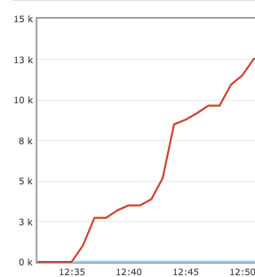

# NSB Outbox Issue
This project seeks to reproduce an issue were having. We have an outbox implementation that uses `NServiceBus.Persistence.CosmosDB` and we're experiencing some problems.

## What's The Problem
We occasionally get an exponential grown of duplicate messages in our queue (Azure Service Bus transport). The message have the same `NServiceBus.MessageId`. After some investigations we cloned the `NServiceBus.Persistence.CosmosDB` and threw random exceptions in the hope that we can find where the behavior is triggered. 

Eventually we found it. If we throw an exception in the [SetAsDispatched](https://github.com/vince-nyanga/nsb-cosmosdb-outbox/blob/b80366163cd841a8305175900971a3eacd956e5e/Src/NServiceBus.Persistence.CosmosDB/Outbox/OutboxPersister.cs?_pjax=%23js-repo-pjax-container%2C%20div%5Bitemtype%3D%22http%3A%2F%2Fschema.org%2FSoftwareSourceCode%22%5D%20main%2C%20%5Bdata-pjax-container%5D#L73) method inside the `OutboxPersister` class, we get an infinite number of retries which leads to the exponential growth of messages as indicated above.

### The Question We Have
Why doesn't the failing message get sent to the error queue? Surely after a couple of retries it should end up in the error queue.

## How To Run
- To run the solution as is you need to have RabbitMQ running and set the connection string in the client, and worker `Program.cs` classes.
- Run both the client and worker
- Add a todo item in the client

You may use the `LearningTransport` or any other transport if you need. RabbitMQ was used so we may be able to visualize the growth of the queue.

Below is the graph that shows the number of duplicate messages we got in the queue. We have observed that the more messages a handler dispatches the faster the queue grows.

